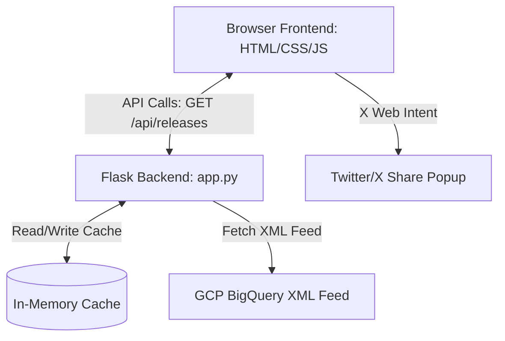

# BQ Pulse — BigQuery Release Notes Explorer & Tweeter

A modern, fast, and beautifully designed web application built with **Python Flask** and vanilla **HTML, CSS, and JavaScript** that fetches Google BigQuery Release Notes and lets you easily share any update directly to X/Twitter.

---

## 🚀 Key Features

*   **Real-time Feed Fetching**: Automatically pulls BigQuery updates from the official Google Cloud XML feed.
*   **Semantic Sub-item Separation**: Converts bulky daily updates into individual, card-based logs categorised as `Feature`, `Announcement`, `Issue`, or `Deprecated`.
*   **In-Memory Caching**: Implements a 10-minute cache on the Flask server to prevent hitting GCP endpoints unnecessarily, while supporting a force-refresh option.
*   **Advanced Filtering & Search**: Instant client-side search by text and filter chips for quick navigation through update types.
*   **Sleek Glassmorphic Dark UI**: Tailored with Outfit typography, glowing states, micro-animations, and a timeline layout.
*   **Interactive Tweet Composer**: Slide-over panel that drafts formatted tweets with auto-truncation, character validation, and a circular progress ring visualising X's 280-character limit.

---

## 🛠️ Technology Stack

*   **Backend**: Python 3 (Flask)
*   **Frontend**: Vanilla HTML5, CSS3, JavaScript (ES6)
*   **Icons**: Lucide Icons
*   **Fonts**: Google Fonts (Outfit, Space Grotesk)
*   **Version Control**: Git & GitHub CLI

---

## 📊 Application Architecture



---

## 📂 File Directory

```text
bq-releases-notes/
├── .gitignore
├── app.py
├── requirements.txt
├── README.md
├── templates/
│   └── index.html
└── static/
    ├── css/
    │   └── style.css
    └── js/
        └── main.js
```

---

## ⚙️ Setup & Running Locally

### Prerequisites
Make sure you have **Python 3.10+** and **pip** installed.

### 1. Clone the repository (if applicable)
```bash
git clone https://github.com/tVhowww/tVhow-20june-2026-event-talks-app.git
cd tVhow-20june-2026-event-talks-app
```

### 2. Set up a virtual environment
```bash
# Windows
python -m venv .venv
.venv\Scripts\activate

# macOS / Linux
python3 -m venv .venv
source .venv/bin/activate
```

### 3. Install dependencies
```bash
pip install -r requirements.txt
```

### 4. Run the development server
```bash
python app.py
```

Open your browser and navigate to **[http://127.0.0.1:5000](http://127.0.0.1:5000)**.

---

## 🐦 Twitter Sandbox Mechanics

Inside the slide-over composer panel:
1.  **Draft Format**:
    `BigQuery [Type] (Date): Description text... Details: <URL>`
2.  **Auto-Truncation**:
    The description text is calculated against the remaining space left by the URL and metadata. If it exceeds X's limit, it is automatically truncated and suffixed with `...`.
3.  **Circular Ring Counter**:
    The progress circle fills up and turns yellow when 20 characters are left, and turns red (disabling the send button) if the user types past 280 characters.
